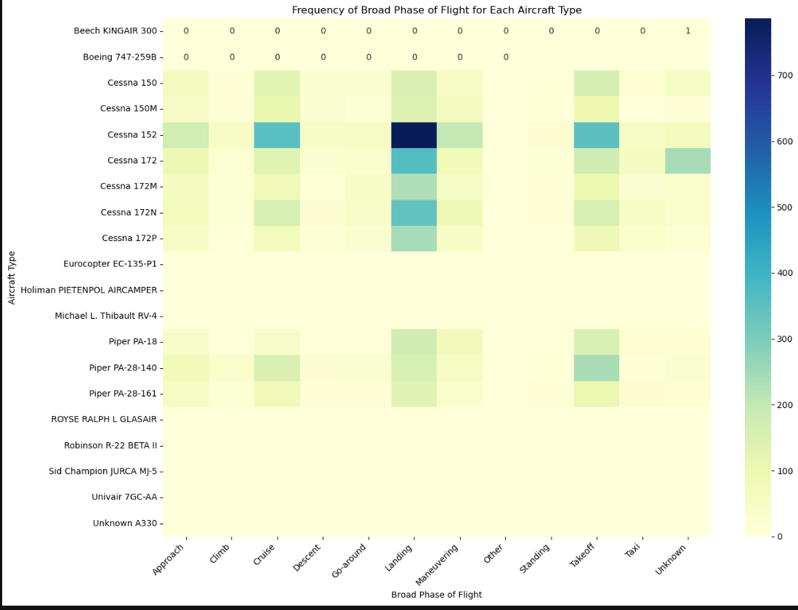
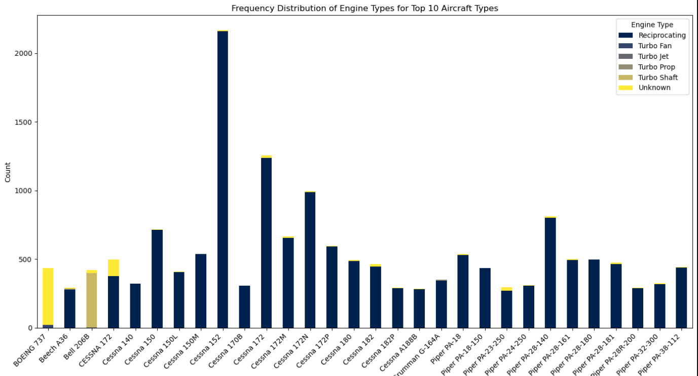
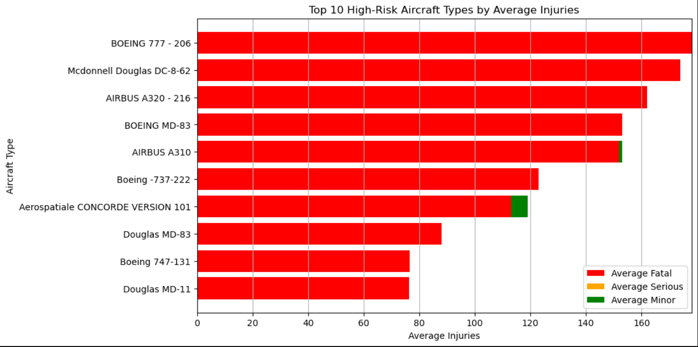

# Phase 1 Project: Aircraft Risk Identification

## Business Understanding
### Stakeholder
The primary stakeholder for this analysis is the head of the new aviation division in the company. 

### Key Business Questions
1. Which aircraft types have the lowest risk based on historical accident data?
2. What are the common factors associated with high-risk aircraft types?
3. How do weather conditions and the phase of flight impact the risk associated with different aircraft types?

## Data Understanding and Analysis
### Source of Data
The [dataset](https://www.kaggle.com/datasets/khsamaha/aviation-accident-database-synopses) used for this analysis is from the National Transportation Safety Board, covering aviation accidents from 1948 to 2022.

### Description of Data
The dataset includes various features such as:

- **Aircraft Type:** The model or type of the aircraft involved in the accident. Examples include Cessna 172, Boeing 747, Piper PA-28, etc.
- **Weather Conditions:** The meteorological conditions at the time of the accident.
  - **VMC (Visual Meteorological Conditions):** Weather conditions that allow the pilot to operate the aircraft by visual reference to the environment outside the cockpit.
  - **IMC (Instrument Meteorological Conditions):** Weather conditions that require the pilot to operate the aircraft solely by reference to the instruments inside the cockpit, due to poor visibility.
- **Broad Phase of Flight:** The general phase of flight during which the accident occurred. This includes stages such as:
  - Approach
  - Climb
  - Cruise
  - Descent
  - Go-around
  - Landing
  - Maneuvering
  - Standing
  - Takeoff
  - Taxi
- **Engine Type:** The type of engine used in the aircraft. Categories include:
  - Reciprocating
  - Turbo Fan
  - Turbo Jet
  - Turbo Prop
  - Turbo Shaft
  - Unknown
- **Number of Engines:** The number of engines the aircraft is equipped with.
- **Aircraft Damage:** The extent of damage to the aircraft as a result of the accident. Categories include:
  - Destroyed
  - Substantial
  - Minor
- **Total Fatal Injuries:** The total number of fatalities resulting from the accident.
- **Total Serious Injuries:** The total number of serious injuries (non-fatal) resulting from the accident.
- **Total Minor Injuries:** The total number of minor injuries resulting from the accident.

### Visualizations
1. **Heatmap of Broad Phase of Flight Frequency for Aircraft Types:**

    This heatmap visualizes the frequency of accidents for various aircraft types across different broad phases of flight. Each cell in the heatmap represents the number of accidents an aircraft type experienced during a specific phase of flight, such as approach, climb, cruise, descent, landing, maneuvering, takeoff, and taxi. The color intensity in each cell indicates the frequency of accidents, with darker shades representing higher frequencies.

2. **Stacked Bar Chart of Engine Types for Top 30 Aircraft Types:**

    This stacked bar chart shows the distribution of engine types among the top 30 aircraft types based on occurrence counts. Each bar represents an aircraft type, and the different segments of the bar indicate the proportion of various engine types, such as reciprocating, turbo fan, turbo jet, turbo prop, turbo shaft, and unknown.

3. **Severity Analysis by Aircraft Type:**

    This bar chart displays the average number of fatal, serious, and minor injuries for different aircraft types. It provides insights into the severity of accidents associated with each aircraft type.

## Conclusion
### Summary of Conclusions
1. **Low-Risk Aircraft Types:** Analysis identified aircraft types with lower frequencies of accidents and lower severity of injuries.
2. **Impact of Weather Conditions:** VMC (Visual Meteorological Conditions) and IMC (Instrument Meteorological Conditions) have significant impacts on the risk associated with different aircraft types.
3. **Phase of Flight:** Certain phases of flight, such as landing and takeoff, are more prone to accidents across different aircraft types.

# Presentation
If the link to the pdf in the repository does not work, please follow this link to find the presentation. [Aircraft Risk Analysis Presentation](https://www.canva.com/design/DAGHuvdEosY/Kyj4bokJU_MMe4Up9sgOAQ/edit?utm_content=DAGHuvdEosY&utm_campaign=designshare&utm_medium=link2&utm_source=sharebutton)

# Tableau Visualizations
Find the link to the interactive dashboard [here](https://public.tableau.com/app/profile/gloria.ngure/viz/Aircraft-Risk-Analysis-Workbook/AircraftAnalysisDashboard?publish=yes).